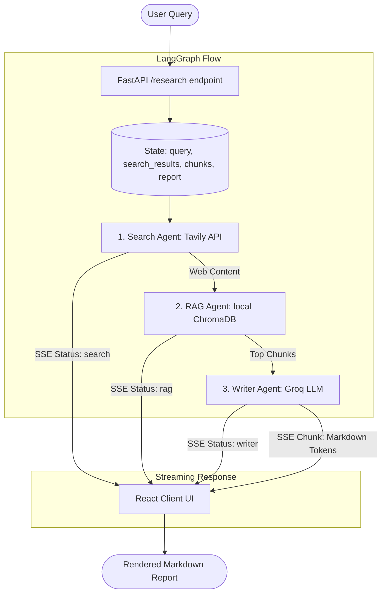

# Multi-Agent Research Assistant: Architecture & System Overview

This project is a streaming, multi-agent research platform. It automates web search, performs retrieval-augmented generation (RAG) using local vector embeddings, and generates detailed, citation-rich markdown reports that stream in real time.

---

## 🛠️ The Tech Stack

The application is built on a split architecture:

### 1. Backend Service
* **FastAPI**: Asynchronous high-performance web framework providing endpoints and Server-Sent Events (SSE) streaming capabilities.
* **LangGraph**: Orchestrates the multi-agent system as a stateful, cyclic workflow (StateGraph).
* **Tavily AI**: Modern web-search engine optimized specifically for LLMs to gather high-quality external web context.
* **ChromaDB**: Local, AI-native vector database utilized to index and query crawled search results.
* **Sentence-Transformers (`all-MiniLM-L6-v2`)**: Embedding model running completely locally on the server to embed text chunks without incurring external API costs.
* **Groq Cloud LLM (`llama-3.3-70b-versatile`)**: Ultra-fast inference engine powering the Writer Agent to assemble and stream markdown reports.

### 2. Frontend Client
* **React + TypeScript + Vite**: Fast, type-safe user interface.
* **Server-Sent Events (SSE) Reader**: Native stream reader that consumes data chunk-by-chunk from the backend.
* **Markdown Renderer**: Dynamically renders markdown tokens with automatic scroll-to-bottom behavior.

---

## 🔄 Agent Workflow

The system is configured as a sequential **LangGraph StateGraph** consisting of three dedicated agents:

### Detailed Workflow Step-by-Step

1. **Query Submission**:
   The user enters a research topic (e.g., *"What is LangGraph and how does it extend LCEL?"*) into the search bar. The React app sends a POST request to `/research`.

2. **Search Stage (`Search Agent`)**:
   * The workflow enters the `search` node.
   * The `search_agent` queries the Tavily API, retrieves the top 5 web results, formats them, and writes them to the graph's `search_results` state.
   * FastAPI emits a status update to the SSE stream: `event: status, data: search`.

3. **Retrieval-Augmented Generation Stage (`RAG Agent`)**:
   * The workflow enters the `rag` node.
   * The `rag_agent` splits the search results into chunks using a character-based sliding window.
   * Chunks are embedded locally via the `all-MiniLM-L6-v2` model and saved into a temporary in-memory/persisted ChromaDB collection.
   * The agent queries ChromaDB with the user's original query, retrieves the top 3 most relevant chunks, and writes them to the `retrieved_chunks` state.
   * FastAPI emits a status update to the SSE stream: `event: status, data: rag`.

4. **Writing Stage (`Writer Agent`)**:
   * The workflow enters the `writer` node.
   * The `writer_agent` builds a synthesis prompt containing the retrieved chunks, source URLs, and original query.
   * It calls the Groq LLM using async token streaming (`astream`).
   * As the model outputs tokens, they are forwarded directly to the user through the SSE stream.
   * FastAPI emits a status update: `event: status, data: writer` and streams tokens: `event: chunk, data: token_text`.

5. **Completion**:
   * Once the report is generated, the graph exits.
   * FastAPI sends a completion signal `event: done, data: complete` and closes the connection.
